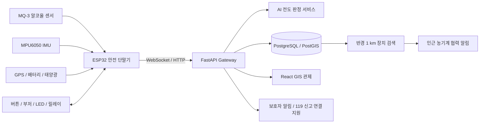

# AgriGuard AIoT

> **고령 농업인을 위한 음주 예방·전도 감지·근거리 협력구조 농기계 안전 플랫폼**

`agriguard-aiot`는 충북 남부권(보은·옥천·영동)을 우선 실증 지역으로 설정한 AIoT 농기계 안전 프로젝트입니다. 농기계 운행 전 위험 예방, 운행 중 전도 판정, 사고 후 신고 지원과 반경 1 km 협력구조까지 하나의 안전 단말기와 GIS 관제 시스템으로 연결합니다.

> 개발 상태: **기획 확정 / 디지털 시제품 개발 예정**  
> 참가 목표: **제13회 전국 ICT융합 공모전 - 인공지능 시제품 분야**

---

## 1. 문제 정의

고령 농업인이 경운기·트랙터를 혼자 운행하다 전도되면 사고 신고와 초기 발견이 지연될 수 있습니다. 단순 기울기 임계값만 사용하는 장치는 급경사, 적재, 작업 진동을 실제 사고로 오판할 가능성이 있으며, 사고 현장 주변에 도움을 줄 수 있는 농업인이 있어도 이를 즉시 연결하는 수단이 부족합니다.

AgriGuard AIoT는 다음의 연속적인 안전 흐름을 제공합니다.

```text
운행 전 예방
→ 운행 중 AI 전도 감지
→ 운전자 취소 확인
→ GPS 기반 SOS 생성
→ 관제·보호자·119 신고 연결 지원
→ 반경 1 km 농기계 협력 알림
→ 구조 상태 기록 및 사고 리플레이
```

---

## 2. 핵심 기능 6가지

| No. | 기능 | 구현 내용 | MVP 완료 기준 |
|---:|---|---|---|
| 1 | **운행 전 음주 위험 사전 선별** | 호흡 알코올 센서를 2회 측정하여 `정상·재측정·위험`으로 분류하고, 위험 시 정지 상태에서 모형 시동 릴레이를 잠급니다. | 정상 입력에서는 모터가 동작하고 위험 입력에서는 릴레이가 차단되며 이벤트가 서버에 기록됨 |
| 2 | **AI 기반 전도·전복 위험 판정** | MPU6050의 가속도·각속도, GPS 속도, 충격 이후 무동작 시간을 결합해 정상 경사·작업 진동·실제 전도를 구분합니다. | 정상/경사/진동/전도 4개 시나리오를 분류하고 위험도 점수를 반환함 |
| 3 | **GPS 기반 긴급 SOS 및 119 신고 지원** | 사고 의심 후 10초 동안 취소 입력이 없으면 위치·시간·장치·위험도 정보를 자동 구성해 관제자와 보호자에게 전달합니다. | 취소 미응답 시 SOS 이벤트가 생성되고 지도에 사고 위치가 표시됨 |
| 4 | **반경 1 km 근거리 농기계 협력 알림** | 사고 지점 주변의 온라인 장치를 검색해 인근 작업자에게 알림을 전송하고 `지원 가능·지원 불가` 응답을 받습니다. | 사고 장치를 제외한 1 km 이내 장치만 선별되어 알림과 응답 상태가 표시됨 |
| 5 | **WebSocket GIS 관제·사고 리플레이** | React/TypeScript 지도에서 장치·사고·구조 상태를 실시간 표시하고 사고 직전 30초의 센서와 GPS 이동 경로를 재생합니다. | 새 텔레메트리와 사고 이벤트가 새로고침 없이 반영되고 30초 데이터를 재생함 |
| 6 | **태양광 보조충전·전원 상태 관리** | 소형 태양광 패널과 배터리로 안전 단말기의 운용시간을 보조하고 배터리 잔량·충전 여부·저전압 상태를 관제합니다. | 충전 여부와 배터리 상태가 장치에서 서버로 전송되고 저전압 경고가 발생함 |

### 구현 범위 주의

- 음주 센서값은 법적·의학적 혈중알코올농도 확정값으로 사용하지 않습니다.
- 실제 농기계 시동선 대신 모형 릴레이와 DC 모터로 시연합니다.
- 주행 중 엔진을 강제로 정지시키지 않습니다.
- 119 기능은 공식 연계 전까지 **신고 정보 자동작성 및 전화·문자·앱 연결 지원**으로 구현합니다.
- 태양광은 농기계 구동용이 아닌 **안전 단말기 보조충전용**입니다.

---

## 3. 사용자 시나리오

```text
1. 운전자가 안전 단말기의 전원을 켭니다.
2. 장치는 음주 위험 사전 선별을 요청합니다.
3. 정상 판정 시 모형 시동이 허용되고, 위험 판정 시 재측정 또는 시동 제한이 적용됩니다.
4. 운행 중 ESP32가 IMU·GPS·배터리 데이터를 수집해 서버로 전송합니다.
5. AI 모델이 기울기·충격·무동작·속도를 분석해 전도 위험도를 계산합니다.
6. 사고 의심 시 부저와 10초 취소 타이머가 작동합니다.
7. 운전자 응답이 없으면 GPS 기반 SOS 이벤트가 확정됩니다.
8. 관제 화면과 보호자에게 사고 정보가 전달되고 119 신고 연결 정보가 자동 구성됩니다.
9. 서버가 반경 1 km 이내 온라인 농기계를 검색해 협력구조 알림을 보냅니다.
10. 지원 가능한 작업자의 응답과 구조 진행 상태를 관제 화면에서 관리합니다.
11. 사고 직전 30초 센서·속도·위치 데이터가 사고 이력에 저장됩니다.
```

---

## 4. 시스템 아키텍처



### 데이터 흐름

```text
센서 수집
→ 장치 전처리
→ WebSocket 텔레메트리 전송
→ FastAPI 메시지 검증
→ DB 저장 및 AI 판정
→ 사고 상태 머신 실행
→ 관제 화면 브로드캐스트
→ 보호자·인근 장치 알림
```

### 사고 상태

```text
NORMAL
→ SUSPECTED
→ PENDING_CONFIRMATION
→ DETECTED
→ ACKNOWLEDGED
→ DISPATCHED
→ RESOLVED
```

취소 입력이 들어오면 `PENDING_CONFIRMATION → CANCELLED`로 전환합니다.

---

## 5. 반경 1 km 협력 알림 규칙

- 사고 GPS를 기준으로 최근 위치가 유효한 온라인 장치를 조회합니다.
- PostGIS 또는 Haversine 거리 계산으로 `distance <= 1,000 m`인 장치만 선택합니다.
- 사고 장치 자신, 오프라인 장치, 오래된 위치정보, 고속 이동 장치는 제외합니다.
- 인근 장치에는 부저·OLED·웹/앱 알림 중 구현 가능한 채널로 경고를 전송합니다.
- 수신자는 `지원 가능`, `지원 불가`, `확인 중`으로 응답할 수 있습니다.
- 운행 중인 장치에는 화면 방해를 최소화하고 음향·단순 버튼 중심으로 알립니다.
- 실명 대신 장치 식별자와 사고 대응에 필요한 최소 위치정보만 사용합니다.
- 협력 알림은 119 신고를 대체하지 않고 현장 초기 발견을 보조합니다.

---

## 6. 기술 스택

| 영역 | 기술 |
|---|---|
| Device | ESP32, MPU6050, GPS, MQ-3, Relay, Buzzer, LED, Button, Solar Charger, Battery Monitor |
| Firmware | C/C++, Arduino Framework 또는 ESP-IDF |
| AI/Data | Python, NumPy, Pandas, scikit-learn, Random Forest/XGBoost 후보 |
| Backend | FastAPI, WebSocket, REST API, PostgreSQL, PostGIS, SQLAlchemy |
| Frontend | React, TypeScript, 지도 SDK, 실시간 텔레메트리 차트 |
| Infra/Test | Linux, Docker Compose, pytest, GitHub Actions(추후) |

---

## 7. 이벤트 규격 초안

```json
{
  "type": "incident.detected",
  "eventId": "evt-20260801-0001",
  "deviceId": "tractor-001",
  "occurredAt": "2026-08-01T14:12:30+09:00",
  "location": {
    "latitude": 36.3012,
    "longitude": 127.5874
  },
  "riskScore": 0.94,
  "status": "detected",
  "batteryPercent": 78,
  "solarCharging": true
}
```

주요 이벤트:

```text
device.telemetry
device.status
device.connected
device.disconnected
safety.alcohol_normal
safety.alcohol_recheck
safety.alcohol_warning
incident.suspected
incident.cancelled
incident.detected
incident.nearby
incident.acknowledged
incident.dispatched
incident.resolved
power.charging
power.low_battery
```

---

## 8. REST API 초안

```text
POST   /api/v1/devices/register
POST   /api/v1/telemetry
GET    /api/v1/devices
GET    /api/v1/devices/{device_id}

GET    /api/v1/incidents
GET    /api/v1/incidents/{incident_id}
PATCH  /api/v1/incidents/{incident_id}/status
GET    /api/v1/incidents/{incident_id}/replay
POST   /api/v1/incidents/{incident_id}/acknowledge

GET    /api/v1/incidents/{incident_id}/nearby-devices
POST   /api/v1/incidents/{incident_id}/nearby-alert
POST   /api/v1/incidents/{incident_id}/support-response
```

WebSocket 채널:

```text
/ws/device/{device_id}      # 장치 텔레메트리 및 장치 알림
/ws/control-room            # 관제 화면 실시간 이벤트
```

---

## 9. 저장소 구조

```text
agriguard-aiot/
├─ device/
│  ├─ firmware/             # ESP32 센서·버튼·부저·릴레이 제어
│  ├─ protocol/             # 장치 메시지 스키마
│  └─ hardware/             # 핀맵·회로·부품 목록
├─ backend/
│  ├─ app/api/              # REST API
│  ├─ app/ws/               # WebSocket 연결·브로드캐스트
│  ├─ app/models/           # DB 모델
│  └─ app/services/         # 사고·거리·알림 서비스
├─ ai/
│  ├─ data/                 # 학습용 센서 데이터
│  ├─ features/             # 특징 추출
│  ├─ models/               # 판정 모델
│  └─ evaluation/           # 성능 평가
├─ frontend/
│  ├─ src/pages/            # 관제·사고·장치 화면
│  ├─ src/components/       # 공통 UI
│  └─ src/services/         # REST·WebSocket 클라이언트
├─ simulator/               # 가상 센서·GPS·사고 이벤트 생성기
├─ docs/                    # 요구사항·API·UI·회로·시험·발표자료
├─ tests/                   # 단위·통합·시나리오 테스트
├─ docker-compose.yml
└─ README.md
```

---

## 10. Member 역할 분담

역할은 단순 기술 목록이 아니라 **주 책임 영역, 직접 산출물, 지원 영역**을 기준으로 분리합니다.

| Member | Role | 주 책임 영역 | 주요 산출물 | 지원 영역 |
|---|---|---|---|---|
| **이영준** [@gxmzung](https://github.com/gxmzung) | **Technical PM / IoT·Realtime Integration Lead** | 요구사항·시스템 아키텍처, 하드웨어 구성, 장치 메시지 규격, FastAPI WebSocket, 전체 통합·일정·발표 | 시스템 구성도, 핀맵·통신 규격, WebSocket 모듈, 통합 시나리오, 기술문서·발표자료 | ESP32·GPS 통합, 장애 분석, 코드 리뷰 |
| **이승민** [@leexxx404](https://github.com/leexxx404) | **Device Firmware & Frontend Developer** | ESP32 센서·액추에이터 제어, React 실시간 화면, WebSocket 클라이언트 | IMU·버튼·부저·LED·릴레이 펌웨어, 장치 상태·사고 알림 UI | 하드웨어 결선, 프론트 API 연동, 통합 테스트 |
| **장서진** [@seojin103](https://github.com/seojin103) | **Backend & Data Developer** | FastAPI REST API, DB 스키마, 센서·사고 이력 저장, 시뮬레이터·QA | CRUD API, PostgreSQL/PostGIS 모델, 가상 장치 시뮬레이터, API 테스트 | WebSocket 서버, 데이터 전처리, 배포 환경 |
| **홍은채** [@heunc2](https://github.com/heunc2) | **UI/UX Lead** | 사용자 흐름, 정보구조, 디자인 시스템, GIS 관제·사고 대응 UX | Figma 와이어프레임, 화면 명세, 디자인 토큰, 사용성 점검표 | React 화면 검수, 접근성·반응형 개선, 시연 화면 구성 |
| **김민규** [@k0112mk](https://github.com/k0112mk) | **AI & Sensor Analytics Lead** | IMU 시계열 전처리, 특징 추출, 전도 위험도 판정, 오탐 감소·성능 평가 | 데이터 수집 규격, 기준선 알고리즘, 학습 모델, 평가 리포트, 추론 API | 센서 캘리브레이션 기준, 사고 리플레이 분석 |

### 역할 경계

- **이영준:** 하드웨어·통신의 설계 및 최종 통합 책임
- **이승민:** 장치 펌웨어와 관제 프론트의 직접 구현
- **장서진:** 서버·DB·시뮬레이터의 직접 구현
- **홍은채:** UI/UX 설계와 구현 검수 책임
- **김민규:** 센서 분석·AI 모델과 성능 검증 책임

### 기능별 Owner

| 기능 | Owner | Support |
|---|---|---|
| 음주 선별·시동 잠금 | 이승민 | 이영준, 장서진 |
| AI 전도 판정 | 김민규 | 이영준, 장서진 |
| GPS·SOS 상태 머신 | 이영준 | 장서진 |
| 반경 1 km 검색·협력 알림 | 장서진 | 이영준, 이승민 |
| WebSocket GIS 관제 | 이영준 | 이승민, 홍은채 |
| 태양광·배터리 관제 | 이승민 | 이영준, 장서진 |
| UI/UX·디자인 시스템 | 홍은채 | 이승민 |
| 통합 시험·발표 | 이영준 | 전원 |

---

## 11. 개발 일정

### 전체 일정 원칙

- 1~2주차에 **장치 → 서버 → 화면**의 최소 통신 경로를 먼저 완성합니다.
- AI 학습 전에 규칙 기반 판정기를 구현해 기준선을 확보합니다.
- 4주차까지 핵심 사고 시나리오를 E2E로 연결합니다.
- 5주차에는 기능 추가보다 통합 안정화와 시연 재현성에 집중합니다.
- 기능이 지연되면 `전도 감지·SOS·관제`를 우선하고 태양광·음주·리플레이 순으로 범위를 조정합니다.

| 주차 | 핵심 목표 | 담당 | 주요 작업 | 완료 기준 |
|---:|---|---|---|---|
| **1주차** | 요구사항·인터페이스 확정 | 이영준 중심 / 전원 | 기능 범위 동결, 핀맵·BOM, API·이벤트 스키마, Figma 와이어프레임, 저장소 구조 | 센서 원시값을 시리얼에서 확인하고 시뮬레이터 데이터가 서버에 수신됨 |
| **2주차** | 실시간 데이터 파이프라인 | 이영준·이승민·장서진 | ESP32 IMU/GPS 전송, FastAPI WebSocket, DB 기본 모델, React 장치 상태 화면 | 실제 또는 가상 장치 데이터가 서버를 거쳐 화면에서 실시간 갱신됨 |
| **3주차** | 전도 판정·사고 상태 머신 | 김민규·이영준 | 정상/경사/진동/전도 데이터 수집, 특징 추출, 규칙 기반 기준선, 10초 취소 타이머 | 사고 후보→취소 또는 사고 확정 흐름이 반복 재현됨 |
| **4주차** | SOS·1 km 협력구조 통합 | 장서진·이영준 | GPS 사고 등록, 반경 장치 검색, 인근 알림·응답, 구조 상태 관리 | 사고 발생→관제 표시→인근 장치 알림→지원 응답까지 E2E 시연됨 |
| **5주차** | 6개 기능 통합·UI 완성 | 전원 | 음주 센서·릴레이, 태양광·배터리, 30초 리플레이, GIS UX, 예외처리 | 6개 기능이 하나의 3분 시나리오에서 끊김 없이 동작함 |
| **6주차** | 검증·발표·제출 | 전원 | 오탐·통신 끊김·저전압 시험, 버그 수정, 발표자료·영상·백업 시연 | 반복 가능한 실시간 시연, 테스트 결과표, 시연 영상, 제출본 완성 |

### 주차별 개인 산출물

| Member | 1~2주차 | 3~4주차 | 5~6주차 |
|---|---|---|---|
| 이영준 | 요구사항·아키텍처·WebSocket 규격 | 사고 상태 머신·통합 | E2E 안정화·문서·발표 |
| 이승민 | ESP32 기본 펌웨어·React 기본 화면 | 버튼·부저·릴레이·실시간 UI | 전원 관제·통합 화면 수정 |
| 장서진 | FastAPI·DB·시뮬레이터 | 사고·거리·응답 API | 로그·테스트·배포 보완 |
| 홍은채 | Figma·정보구조·디자인 시스템 | 관제·사고 대응 UX | 사용성 검수·시연 UI 개선 |
| 김민규 | 데이터 수집·라벨 기준 | 특징 추출·기준 모델·ML 모델 | 성능 평가·오탐 개선·추론 통합 |

---

## 12. 시험 시나리오

| ID | 시험 상황 | 기대 결과 |
|---|---|---|
| T-01 | 정상 평지 주행 | 사고 이벤트가 발생하지 않음 |
| T-02 | 경사면 정차 | 기울기만으로 사고 확정하지 않음 |
| T-03 | 작업 진동·순간 충격 | 충격 후 자세 회복 시 사고가 취소됨 |
| T-04 | 전도 후 무동작 | 사고 의심·10초 확인 후 SOS가 확정됨 |
| T-05 | 전도 직후 취소 버튼 | SOS가 취소되고 취소 이력이 기록됨 |
| T-06 | 1 km 이내 장치 2대 | 두 장치에만 협력 알림이 전달됨 |
| T-07 | 1 km 밖 장치 | 협력 알림 대상에서 제외됨 |
| T-08 | WebSocket 연결 끊김 | 자동 재연결되고 미전송 데이터가 복구됨 |
| T-09 | 배터리 저전압 | 관제 화면에 저전압 경고가 표시됨 |
| T-10 | 음주 위험 입력 | 재측정 후 모형 릴레이가 잠기고 이벤트가 기록됨 |

---

## 13. 성공 지표

- 사고 후보 발생 후 관제 알림 표시: **3초 이내** 목표
- 반경 1 km 장치 검색·알림: **5초 이내** 목표
- 전도 시나리오 재현 성공률: **90% 이상** 목표
- 정상 경사·진동 오탐률: **10% 이하** 목표
- WebSocket 연결 중단 후 자동 재연결 성공
- 사고 직전 30초 센서·GPS 데이터 조회 가능
- 배터리 저전압·태양광 충전 상태 관제 표시
- 3분 이내 통합 시연 시나리오 반복 성공

---

## 14. 우선순위와 범위 조정

### P0 — 반드시 완성

1. IMU·GPS 데이터 수집
2. 전도 위험 판정
3. 10초 취소 확인
4. SOS 사고 생성
5. WebSocket GIS 관제
6. 사고·장치 DB 저장

### P1 — 공모전 차별화 기능

1. 반경 1 km 협력 알림
2. 음주 위험 사전 선별
3. 사고 직전 30초 리플레이

### P2 — 확장 기능

1. 태양광 보조충전
2. 배터리 예상 운용시간
3. 보호자 모바일 알림
4. 실제 기관 신고 연계

---

## 15. 라이선스

대회 제출 및 팀 협의 후 공개 범위와 라이선스를 확정합니다.
